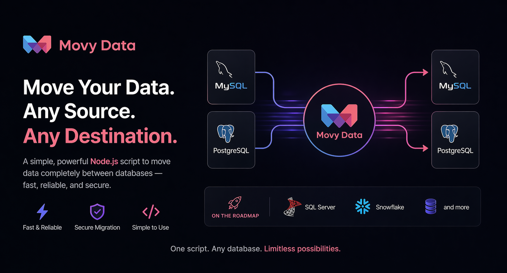

# Movy Data

A database-agnostic CLI migration tool. Migrates schema and data between PostgreSQL and MySQL databases, including cross-engine pairs.

<p align="center">
    
  </p>

## Features

- Full schema migration (tables, columns, constraints, indexes, sequences/enums)
- Same-engine migrations: PostgreSQL → PostgreSQL, MySQL → MySQL
- Cross-engine migrations: PostgreSQL ↔ MySQL
- Schema diff — only applies changes missing on the destination
- Custom query migration: run a SQL query on the source and land results as a new table on the destination
- Row-count validation to verify migration completeness
- Connection retry with exponential backoff
- Env-var pre-fill — set credentials in `.env` to skip interactive prompts
- Structured logs written to console and a timestamped file under `logs/`

## Requirements

- Node.js 18+
- Access to source and destination databases

## Installation

```bash
npm install
```

## Configuration

Copy `.env.example` to `.env` and fill in the variables for your scenario:

```bash
cp .env.example .env
```

### Environment variables

Connection credentials follow the pattern `{ROLE}_{DBTYPE}_{FIELD}`:

| Part | Values |
|------|--------|
| `ROLE` | `SOURCE` or `TARGET` |
| `DBTYPE` | `POSTGRES` or `MYSQL` |
| `FIELD` | `HOSTNAME`, `PORT`, `USERNAME`, `PASSWORD`, `DATABASE` |

**Example — MySQL source, PostgreSQL target:**

```env
SOURCE_MYSQL_HOSTNAME=localhost
SOURCE_MYSQL_PORT=3306
SOURCE_MYSQL_USERNAME=root
SOURCE_MYSQL_PASSWORD=secret
SOURCE_MYSQL_DATABASE=myapp

TARGET_POSTGRES_HOSTNAME=localhost
TARGET_POSTGRES_PORT=5432
TARGET_POSTGRES_USERNAME=postgres
TARGET_POSTGRES_PASSWORD=secret
TARGET_POSTGRES_DATABASE=myapp_migrated
```

When at least one `{ROLE}_{DBTYPE}_*` variable is present, the CLI auto-detects the database type for that role and pre-fills any matching fields. Fields not covered by env vars fall back to an interactive prompt. The confirmation summary labels every env-sourced field with `(env)` so you can verify what was loaded automatically.

**Runtime variables:**

| Variable | Default | Description |
|----------|---------|-------------|
| `DEBUG` | unset | Enable verbose debug logging |
| `NODE_ENV` | unset | Set to `production` to load compiled JS from `dist/` |

All env vars are optional — the CLI will prompt for any values not set.

## Usage

```bash
# Interactive CLI
npm start

# Hot-reload dev mode
npm run dev
```

The CLI will prompt for:

1. **App mode** — `migrate` or `validate`
2. **Source connection** — load from env or enter manually: database type, host, port, credentials, database name
3. **Destination connection** — same fields (defaults to source database name)
4. **Migration mode** (migrate only) — `full` (entire database) or `query` (custom SQL → new table)
5. **Execution review** — confirm before running, optionally run row-count validation afterward

## Supported databases

| Database   | Source | Destination |
|------------|--------|-------------|
| PostgreSQL | ✅     | ✅          |
| MySQL      | ✅     | ✅          |
| MSSQL      | ⬜ Planned | ⬜ Planned |
| Snowflake  | ⬜ Planned | ⬜ Planned |

All four cross-engine pairs between PostgreSQL and MySQL are supported.

## Commands

```bash
npm start          # run the CLI
npm run dev        # run with hot reload (ts-node-dev)
npm run build      # compile TypeScript to dist/
npm test           # run all unit tests (vitest)
npm run test:watch # vitest in watch mode
npx tsc --noEmit   # type-check without emitting
```

## Architecture

Built with **hexagonal architecture** — domain logic is pure TypeScript with no I/O; all database interactions go through ports (interfaces).

```
src/
├── domain/           # Types, ports (interfaces), errors — no I/O
├── application/      # Use cases and MigrationOrchestrator
├── infrastructure/   # Concrete adapters (pg, mysql, translators, migrators)
└── presentation/     # CLI prompts and entry point
```

### Migration flow

1. Create destination database if it doesn't exist
2. Inspect source schema; diff against destination
3. Apply schema diff (tables, columns, constraints); types translated via `ISchemaTranslator`
4. Disable FK checks / triggers on destination
5. Migrate data:
   - **PG→PG**: parallel `pg-copy-streams` workers (up to 4 threads), largest tables first
   - **MySQL→MySQL**: sequential batched SELECT + INSERT (batch size 500)
   - **MySQL↔PG**: sequential batched SELECT + INSERT via `CrossDbDataMigrator`
6. Re-enable FK checks / triggers
7. Create indexes (deferred from step 3 for bulk-load performance)
8. Reset sequences (PostgreSQL destinations only)

### Adding a new database

1. Implement `DatabaseAdapterSet` in `src/infrastructure/database/<engine>/`
2. Add type-map(s) in `src/infrastructure/database/translation/type-maps/`
3. Implement `ISchemaTranslator` subclass(es) extending `CrossDbSchemaTranslator`
4. Register in `cli.ts`:
   ```ts
   registry.register(DatabaseType.X, new XAdapterSet())
   registry.registerTranslator(DatabaseType.X, DatabaseType.POSTGRES, () => new XToPostgresTranslator())
   registry.registerDataMigrator(DatabaseType.X, DatabaseType.POSTGRES, () => new CrossDbDataMigrator())
   ```

See `docs/implementation-plan.md` for the full checklist.

## Logs

Each run writes a log file to `logs/movy_YYYY-MM-DD_HH-MM-SS_<src>_to_<dst>.log`.

## Tests

Unit tests live in `tests/unit/`. Integration tests (`tests/integration/`) require real database connections and are not automated.

```bash
npm test
npx vitest run tests/unit/application/migration-orchestrator.service.test.ts
```
