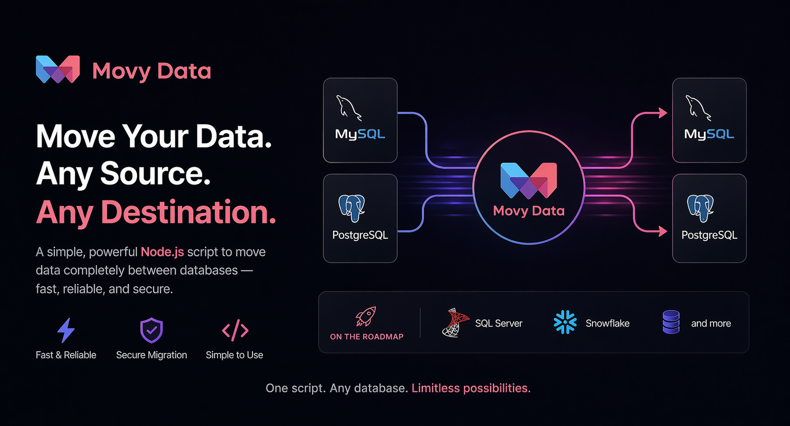

# Movy Data

A database-agnostic CLI migration tool. Migrates schema and data between PostgreSQL, MySQL and MSSQL databases, including every cross-engine pair.

<p align="center">
    
  </p>

## Features

- Full schema migration (tables, columns, constraints, indexes, sequences/enums)
- Same-engine migrations: PostgreSQL → PostgreSQL, MySQL → MySQL, MSSQL → MSSQL
- Cross-engine migrations: PostgreSQL ↔ MySQL, MSSQL ↔ PostgreSQL, MSSQL ↔ MySQL
- Schema diff — only applies changes missing on the destination
- Custom query migration: run a SQL query on the source and land results as a new table on the destination
- Row-count validation to verify migration completeness
- Connection retry with exponential backoff
- Env-var pre-fill — set credentials in `.env` to skip interactive prompts
- Structured logs written to console and a timestamped file under `logs/`

## Requirements

- Node.js 18+
- Access to source and destination databases

## Installation

```bash
npm install
```

## Configuration

Copy `.env.example` to `.env` and fill in the variables for your scenario:

```bash
cp .env.example .env
```

### Environment variables

Connection credentials follow the pattern `{ROLE}_{DBTYPE}_{FIELD}`:

| Part | Values |
|------|--------|
| `ROLE` | `SOURCE` or `TARGET` |
| `DBTYPE` | `POSTGRES`, `MYSQL` or `MSSQL` |
| `FIELD` | `HOSTNAME`, `PORT`, `USERNAME`, `PASSWORD`, `DATABASE` |

**Example — MySQL source, PostgreSQL target:**

```env
SOURCE_MYSQL_HOSTNAME=localhost
SOURCE_MYSQL_PORT=3306
SOURCE_MYSQL_USERNAME=root
SOURCE_MYSQL_PASSWORD=secret
SOURCE_MYSQL_DATABASE=myapp

TARGET_POSTGRES_HOSTNAME=localhost
TARGET_POSTGRES_PORT=5432
TARGET_POSTGRES_USERNAME=postgres
TARGET_POSTGRES_PASSWORD=secret
TARGET_POSTGRES_DATABASE=myapp_migrated
```

**Example — MSSQL source, PostgreSQL target:**

```env
SOURCE_MSSQL_HOSTNAME=localhost
SOURCE_MSSQL_PORT=1433
SOURCE_MSSQL_USERNAME=sa
SOURCE_MSSQL_PASSWORD=secret
SOURCE_MSSQL_DATABASE=myapp

TARGET_POSTGRES_HOSTNAME=localhost
TARGET_POSTGRES_PORT=5432
TARGET_POSTGRES_USERNAME=postgres
TARGET_POSTGRES_PASSWORD=secret
TARGET_POSTGRES_DATABASE=myapp_migrated
```

`SQLSERVER` is accepted as an alias for `MSSQL`. Default ports are filled in per engine
when omitted: PostgreSQL `5432`, MySQL `3306`, MSSQL `1433`.

When at least one `{ROLE}_{DBTYPE}_*` variable is present, the CLI auto-detects the database type for that role and pre-fills any matching fields. Fields not covered by env vars fall back to an interactive prompt. The confirmation summary labels every env-sourced field with `(env)` so you can verify what was loaded automatically.

**Runtime variables:**

| Variable | Default | Description |
|----------|---------|-------------|
| `DEBUG` | unset | Enable verbose debug logging |
| `NODE_ENV` | unset | Set to `production` to load compiled JS from `dist/` |

All env vars are optional — the CLI will prompt for any values not set.

## Usage

```bash
# Interactive CLI
npm start

# Hot-reload dev mode
npm run dev
```

The CLI will prompt for:

1. **App mode** — `migrate` or `validate`
2. **Source connection** — load from env or enter manually: database type, host, port, credentials, database name
3. **Destination connection** — same fields (defaults to source database name)
4. **Migration mode** (migrate only) — `full` (entire database) or `query` (custom SQL → new table; PostgreSQL source **and** destination only)
5. **Execution review** — confirm before running, optionally run row-count validation afterward

## Supported databases

| Database   | Source | Destination |
|------------|--------|-------------|
| PostgreSQL | ✅     | ✅          |
| MySQL      | ✅     | ✅          |
| MSSQL      | ✅     | ✅          |
| Snowflake  | ⬜ Planned | ⬜ Planned |

All nine pairs between PostgreSQL, MySQL and MSSQL are supported — three same-engine and
six cross-engine.

| Source ↓ / Destination → | PostgreSQL | MySQL | MSSQL |
|--------------------------|-----------|-------|-------|
| **PostgreSQL**           | ✅        | ✅    | ✅    |
| **MySQL**                | ✅        | ✅    | ✅    |
| **MSSQL**                | ✅        | ✅    | ✅    |

Selecting Snowflake is accepted by the CLI and fails with a clear "not yet implemented"
message rather than an unhandled error.

## Commands

```bash
pnpm start             # run the CLI (tsx, no build step)
pnpm dev               # run with hot reload
pnpm dev:web           # Nuxt console on :3000
pnpm build             # compile every workspace, then build the web app
pnpm test              # run all unit tests (vitest)
pnpm test:watch        # vitest in watch mode
pnpm test:coverage     # run tests with a coverage report
pnpm typecheck         # type-check every workspace, tests included

# Replay a recorded run through the runner — no database needed.
pnpm simulate --journal /tmp/run.ndjson \
  --simulate apps/runner/fixtures/pg-to-pg-315k.ndjson \
  --run-id demo --speed 0.05
```

Requires **pnpm** (pinned via `packageManager`); npm 10.x crashes resolving the
Nuxt peer graph.

## Architecture

Built with **hexagonal architecture** — domain logic is pure TypeScript with no I/O; all database interactions go through ports (interfaces).

```
src/
├── domain/           # Types, ports (interfaces), errors — no I/O
├── application/      # Use cases and MigrationOrchestrator
├── infrastructure/   # Concrete adapters (pg, mysql, mssql, translators, migrators)
└── presentation/     # CLI prompts and entry point
```

### Migration flow

1. Create destination database if it doesn't exist
2. Inspect source schema; diff against destination
3. Apply schema diff (tables, columns, constraints); types translated via `ISchemaTranslator`
4. Disable FK checks / triggers on destination
5. Migrate data:
   - **PG→PG**: parallel `pg-copy-streams` workers (up to 4 threads), largest tables first
   - **MySQL→MySQL**: sequential batched SELECT + INSERT (batch size 500)
   - **MSSQL→MSSQL**: sequential batched SELECT + INSERT, with `IDENTITY_INSERT` toggled per table
   - **MySQL↔PG**: sequential batched SELECT + INSERT via `CrossDbDataMigrator`
   - **MSSQL↔PG / MSSQL↔MySQL**: sequential batched SELECT + INSERT via `MssqlCrossDbDataMigrator`
6. Re-enable FK checks / triggers
7. Create indexes (deferred from step 3 for bulk-load performance)
8. Reset auto-increment state — PostgreSQL `setval()`, MySQL `ALTER TABLE … AUTO_INCREMENT`, MSSQL `DBCC CHECKIDENT … RESEED`

### Adding a new database

1. Implement `DatabaseAdapterSet` in `src/infrastructure/database/<engine>/`
2. Add type-map(s) in `src/infrastructure/database/translation/type-maps/`
3. Implement `ISchemaTranslator` subclass(es) extending `CrossDbSchemaTranslator`
4. Register in `cli.ts`:
   ```ts
   registry.register(DatabaseType.X, new XAdapterSet())
   registry.registerTranslator(DatabaseType.X, DatabaseType.POSTGRES, () => new XToPostgresTranslator())
   registry.registerDataMigrator(DatabaseType.X, DatabaseType.POSTGRES, () => new CrossDbDataMigrator())
   ```

Adding engine `n + 1` requires `2n` new type maps and `2n` new translators — one per
direction against each existing engine. See
[ADR-0001](docs/adr/0001-direct-pair-type-translation.md) for why translation is
per-pair rather than routed through a canonical type model, and
`docs/implementation-plan.md` for the full checklist.

## Logs

Each run writes a log file to `logs/movy_YYYY-MM-DD_HH-MM-SS_<src>_to_<dst>.log`.

## Tests

Unit tests live in `tests/unit/` and are mock-driven — the whole suite runs without a
database. Integration tests (`tests/integration/`) require real database connections and
are not automated.

```bash
npm test                # full suite
npm run test:coverage   # with coverage report
npx vitest run tests/unit/application/migration-orchestrator.service.test.ts
```

Coverage thresholds in `vitest.config.ts` are set to the current measured floor and
ratchet upward; the target is 80%. See `docs/implementation-plan.md` for the current
per-area breakdown.
